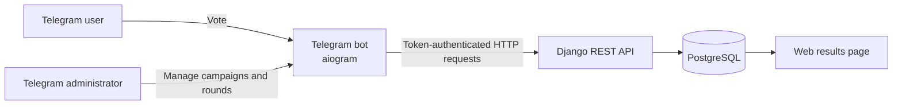

# Voting Management System


Система для организации и проведения многоэтапных голосований
через веб-интерфейс и Telegram-бота.

> Публичная обезличенная версия коммерческого проекта.
> Сведения о заказчике, реальные данные, пользовательские идентификаторы,
> секреты и production-конфигурация не публикуются.

## О проекте

Система автоматизирует создание кампаний и раундов голосования,
управление участниками, приём голосов через Telegram и отображение
текущих результатов в веб-интерфейсе.

В публичной версии сохранены основные архитектурные и технические решения.
Названия, идентификаторы пользователей и демонстрационные данные изменены
или удалены.

## Возможности

### Голосование

- несколько независимых кампаний;
- стандартные и индивидуальные раунды;
- голосование через inline-кнопки Telegram;
- защита от повторного голоса;
- проверка принадлежности участника выбранному раунду;
- публикация и скрытие результатов;
- автоматический подсчёт голосов и определение победителей;
- перенос участников между раундами;
- отображение результатов на веб-странице;
- обновление результатов без полной перезагрузки страницы.

### Управление

Через Telegram-бота администратор может:

- создавать кампании;
- запускать и завершать раунды;
- добавлять и удалять участников;
- выбирать текущий отображаемый раунд;
- задавать количество победителей;
- переносить победителей в следующий раунд;
- восстанавливать завершённые раунды;
- экспортировать результаты в CSV.

### Безопасность и эксплуатация

- Token Authentication между Telegram-ботом и Django API;
- разграничение ролей администраторов;
- ограничение частоты обращений к API;
- anti-flood middleware Telegram-бота;
- проверка повторных голосов на уровне приложения и базы данных;
- защита CSV от formula injection;
- хранение конфигурации в переменных окружения;
- ротация логов Django и Telegram-бота.

## Архитектура



Проект состоит из трёх сервисов:

1. **Django-приложение** — REST API и веб-страница результатов.
2. **Telegram-бот** — пользовательское голосование и административное управление.
3. **PostgreSQL** — хранение кампаний, раундов, участников и голосов.

Telegram-бот взаимодействует с Django через асинхронные HTTP-запросы
и Token Authentication.

## Стек технологий

| Компонент | Технология |
|---|---|
| Backend | Python, Django |
| REST API | Django REST Framework |
| Telegram-бот | aiogram, aiohttp |
| База данных | PostgreSQL |
| Локальная БД | SQLite |
| Application server | Gunicorn |
| Static files | WhiteNoise |
| Конфигурация | python-decouple |
| Контейнеризация | Docker, Docker Compose |
| Логирование | logging, RotatingFileHandler |

## Структура проекта

```text
voting_site/
├── core/                  # настройки и маршрутизация Django
├── voting/                # модели, API и логика голосования
├── tg_bot/                # Telegram-бот и Django API client
├── templates/             # HTML-шаблоны
├── static/                # CSS, изображения и JavaScript
├── Dockerfile
├── docker-compose.yml
├── requirements.txt
└── manage.py
```

## Переменные окружения

Создайте файл `.env` на основе `.env.example`:

```bash
cp .env.example .env
```

Для Windows PowerShell:

```powershell
Copy-Item .env.example .env
```

Основные переменные:

| Переменная | Описание |
|---|---|
| `SECRET_KEY` | Секретный ключ Django |
| `DEBUG` | Режим отладки |
| `ALLOWED_HOSTS` | Разрешённые домены |
| `DB_ENGINE` | `postgres` или `sqlite` |
| `POSTGRES_DB` | Название базы данных |
| `POSTGRES_USER` | Пользователь PostgreSQL |
| `POSTGRES_PASSWORD` | Пароль PostgreSQL |
| `POSTGRES_HOST` | Адрес PostgreSQL |
| `POSTGRES_PORT` | Порт PostgreSQL |
| `TELEGRAM_TOKEN` | Токен Telegram-бота |
| `DJANGO_API_TOKEN` | DRF-токен Telegram-бота |
| `DJANGO_API_BASE` | Адрес Django API |
| `FULL_ADMIN_IDS` | Telegram ID главных администраторов |
| `LIMITED_ADMIN_IDS` | Telegram ID модераторов |

Не публикуйте настоящий `.env`, Telegram-токен, Django-токен
и Telegram ID пользователей.

## Запуск через Docker Compose

### 1. Клонируйте репозиторий

```bash
git clone https://github.com/BulatKSMNT/voting_site.git
cd voting_site
```

### 2. Подготовьте конфигурацию

```bash
cp .env.example .env
```

Заполните необходимые значения в `.env`.

### 3. Соберите и запустите PostgreSQL и Django

```bash
docker compose up -d --build db web
```

### 4. Примените миграции

```bash
docker compose exec web python manage.py migrate
```

### 5. Создайте администратора Django

```bash
docker compose exec web python manage.py createsuperuser
```

### 6. Создайте API-токен

```bash
docker compose exec web python manage.py drf_create_token <username>
```

Сохраните полученное значение в `.env`:

```env
DJANGO_API_TOKEN=your-django-api-token
```

### 7. Перезапустите и запустите Telegram-бота

```bash
docker compose up -d bot
```

### 8. Посмотрите логи

Django:

```bash
docker compose logs -f web
```

Telegram-бот:

```bash
docker compose logs -f bot
```

### 9. Откройте приложение

```text
http://127.0.0.1/
```

Страница результатов:

```text
http://127.0.0.1/voting/results/
```

Django Admin:

```text
http://127.0.0.1/admin/
```

### Остановка

```bash
docker compose down
```

Для удаления локальной базы данных:

```bash
docker compose down -v
```

> Команда `docker compose down -v` удаляет PostgreSQL volume
> и все локальные данные.

## Локальный запуск

```bash
python -m venv .venv
```

Linux/macOS:

```bash
source .venv/bin/activate
```

Windows PowerShell:

```powershell
.venv\Scripts\Activate.ps1
```

Установите зависимости:

```bash
pip install -r requirements.txt
```

Подготовьте `.env` и примените миграции:

```bash
python manage.py migrate
python manage.py runserver
```

Для локального запуска Telegram-бота укажите:

```env
DJANGO_API_BASE=http://127.0.0.1:8000/voting/api
```

Затем в отдельном терминале:

```bash
python tg_bot/bot.py
```

## Модель данных

Основные сущности:

- `Campaign` — кампания голосования;
- `Round` — раунд и его состояние;
- `Participant` — участник определённого раунда;
- `Vote` — голос пользователя за участника.

На уровне базы данных ограничивается повторное голосование одного
пользователя за одного участника в рамках одного раунда.

## Конфиденциальность

Репозиторий является обезличенной публичной версией коммерческой системы.

В нём отсутствуют:

- сведения о заказчике;
- реальные имена участников;
- результаты реальных голосований;
- Telegram ID пользователей и администраторов;
- API-токены и другие секреты;
- production-домен и инфраструктурная конфигурация.

Перед публикацией дополнительных изменений необходимо проверять код,
миграции, историю Git и демонстрационные файлы на наличие закрытых данных.

## Автор

**Булат Хатыпов**

- GitHub: [BulatKSMNT](https://github.com/BulatKSMNT)
- Telegram: [@khat911](https://t.me/khat911)
